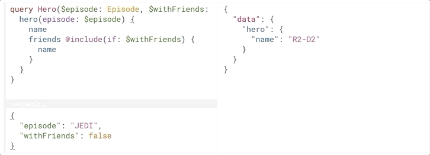

## Introduction
As we mentioned before variables allow us to bypass doing manual string interpolation to build dynamic queries. Well, directives effectively, enable us to change the structure and shape of queries using variables dynamically. 

 A directive can be added to a field or fragment insertion and can modify the execution of the 'query'. The core GraphQL specification includes exactly two directives:
`@include(if: Boolean)` Only include this field in the result if the argument is true.
`@skip(if: Boolean) ` Skip this field if the argument is true.

## So, what is a directive
A `@` character identifies a directive, optionally followed by a list of named arguments, which can appear after almost any form of syntax in the GraphQL query or schema languages. 

For example, we can imagine a UI component that has a summarised and detailed view, where one includes more fields than the other.
  
 

## Built-in directives
Here is some of the built-in directives in the Hypi platform.

### @http 
 TODO
 
### @tan 
A directive which allows any GraphQL definition's field to be provided by a Hypi Arc Tan function.

### @api 
If present on an object then it controls which Hypi CRUD functions will be generated for the type.

### @secret 
 TODO

### @field 
 TODO

### @length
 TODO

### @notNull
Check if the value is not null

### @notEmpty
Check if the string or array is not null nor empty (for strings verifies its not all whitespace).

### @past
Check if the date is in the past

### @future
Check if the date is in the future

### @pattern
Check if the field's value matches the regular expression given a match flag (see https://docs.oracle.com/javase/8/docs/api/java/util/regex/Pattern.html  )

### @email
Check  if the field's value is valid email

### @unique
Adding this to any keyword indexed field ensures that no duplicates can be inserted for that field
