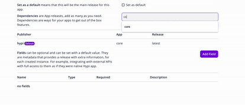
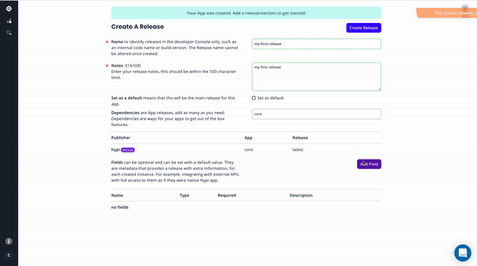

## Introduction   
A release represents a version of an App. Versioning is a critical component of your app updates and maintenance strategy. Versioning is important because:

* Each release/version can be independent.
* Other apps — including other apps that are created, can depend on other apps.

## Create a release
To create a new release go to the Hypi dashboard of the desired Realm.   
1. Click on the App you wish to create a release for.    
2. Click the releases tab on the left. Then click “New” top right.

## Add dependencies
Hypi features the very powerful capability of App inheritance where a dependency can be added to any App you have access to. Adding an App dependency immediately extends the API of your App so that all features in the dependencies become available for your App to use.
      
Hypi includes a "core" App which provides numerous features by default and is required. It defines essential data models e.g. to represent an Account.
 
 
  

## Add Fields
Instance fields provide a way for an App to have templated fields that are configurable on a per instance basis. 

A good example of where instance fields are useful is to hold configuration fields for an app for example a URL or API key (if your app is integrating with external services). 

Instance fields can later be accessed in serverless functions when they execute.

